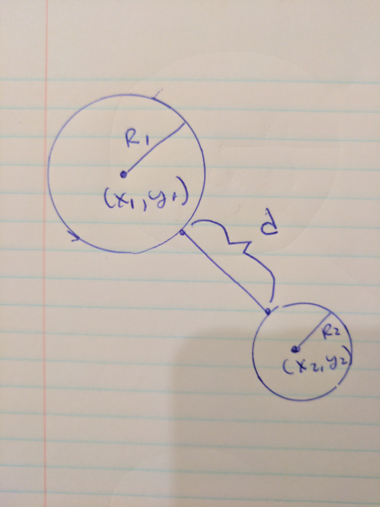

## Distance between circles

**Prompt:** Write a method that finds the distance between circles.

If the circles are overlapping or one circle is entirely within the other, return 0.




Your input will two Circle objects in the following format:

```js
//sample circle input
var circle1 = {
  center : {
    x: 3,
    y: 4
  },
  radius: 2
}
```

Return the distance between the circle edges.
